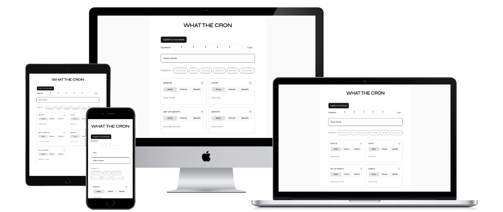

<div align="center">

# WhatTheCron

A two-way cron expression translator. Build expressions visually with a field-by-field toggle UI, or describe a schedule in plain English and let the AI generate the expression, powered by the  Gemini API via a secure Next.js Route Handler.

[](https://nextjs.org)
[](https://typescriptlang.org)
[](https://tailwindcss.com)
[](https://gemini.google.com/app?hl=en-IN)



**[Live Demo →](https://what-the-cron.vercel.app)**

</div>

---

## Why I built this

Cron expressions are one of those things developers write, copy-paste, and immediately forget. I wanted something that lets you build an expression visually or describe a schedule in plain English, understand each field independently, and verify the schedule before deploying it to production.

---

## Features

| Feature | Description |
|---|---|
| Visual field builder | Each of the 5 cron fields has its own toggle with three modes: Every, Interval, and Specific |
| AI reverse translator | Type plain English, get a cron expression back via the Gemini API through a secure Route Handler |
| Plain English output | Converts expressions to human-readable descriptions in real time via `cronstrue` |
| Preset expressions | One-click presets for common schedules like Every Minute, Daily 9AM, and Weekdays |
| Copy to clipboard | Copies the final expression with a single click with visual confirmation

---

## Tech stack

| Layer | Technology |
|---|---|
| Framework | Next.js 15 (App Router) |
| Language | TypeScript |
| Styling | Tailwind CSS + shadcn/ui |
| AI integration | Gemini API via Next.js Route Handler |
| Expression parsing | `cron-parser` |
| Plain English | `cronstrue` |
| Deployment | Vercel |

---

## Project structure

```
app/
├── layout.tsx                    # Root layout 
├── page.tsx                      # Entry page
├── api/
│   └── generate-cron/
│       └── route.ts              # Route Handler — proxies Gemini API server-side
└── components/ui
    ├── CronBuilder.tsx             # Main page
    ├── ToggleButton.tsx            # Per-field UI with mode switching 
    ├── PresetButtons.tsx           # Quick-select preset expressions 
    ├── ExpressionDisplay.tsx       # Live expression bar with copy
    ├── SimpleExpressionDisplay.tsx # Plain English output via cronstrue

```

---


## Getting started

```bash
# 1. Clone the repo
git clone https://github.com/Kaustubhjogle/What-The-Cron.git
cd whatthecron

# 2. Install dependencies
npm install
npm install cronstrue cron-parser
npm install --save-dev @types/cron-parser

# 3. Add your Gemini API key
# Add GEMINI_API_KEY=your_key_here to .env

# 4. Start the dev server
npm run dev
```

Open [http://localhost:3000](http://localhost:3000).

---

## Cron expression reference

```
* * * * *
│ │ │ │ │
│ │ │ │ └── Day of week    (0–6, Sunday = 0)
│ │ │ └──── Month          (1–12)
│ │ └────── Day of month   (1–31)
│ └──────── Hour           (0–23)
└────────── Minute         (0–59)
```

| Syntax | Meaning |
|---|---|
| `*` | Every unit |
| `*/5` | Every 5 units |
| `5` | At exactly 5 |
| `1-5` | Range from 1 to 5 |
| `1,3,5` | Specific values |

---